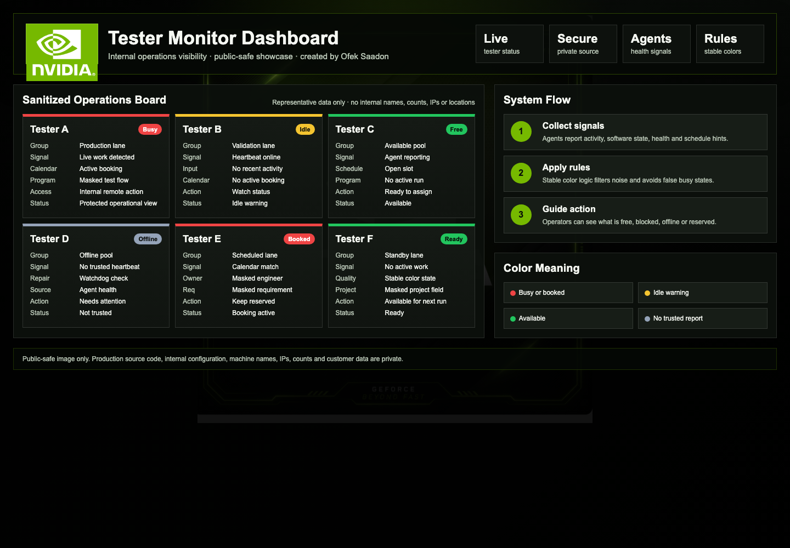
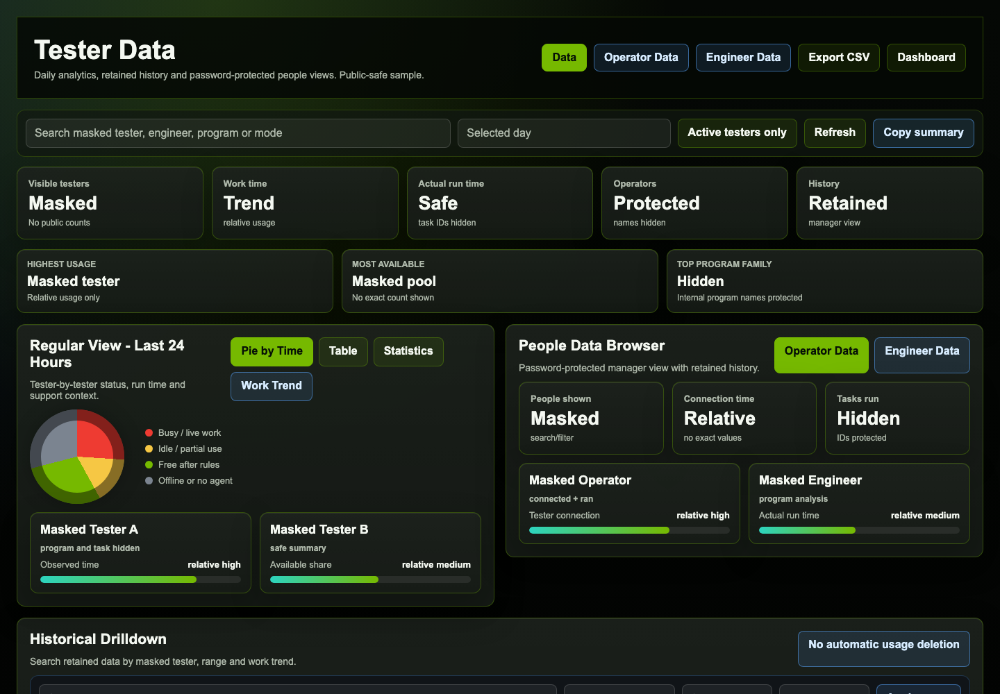
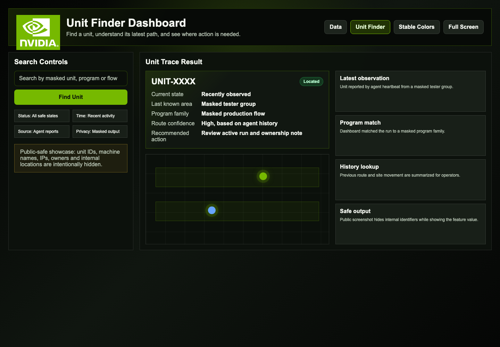
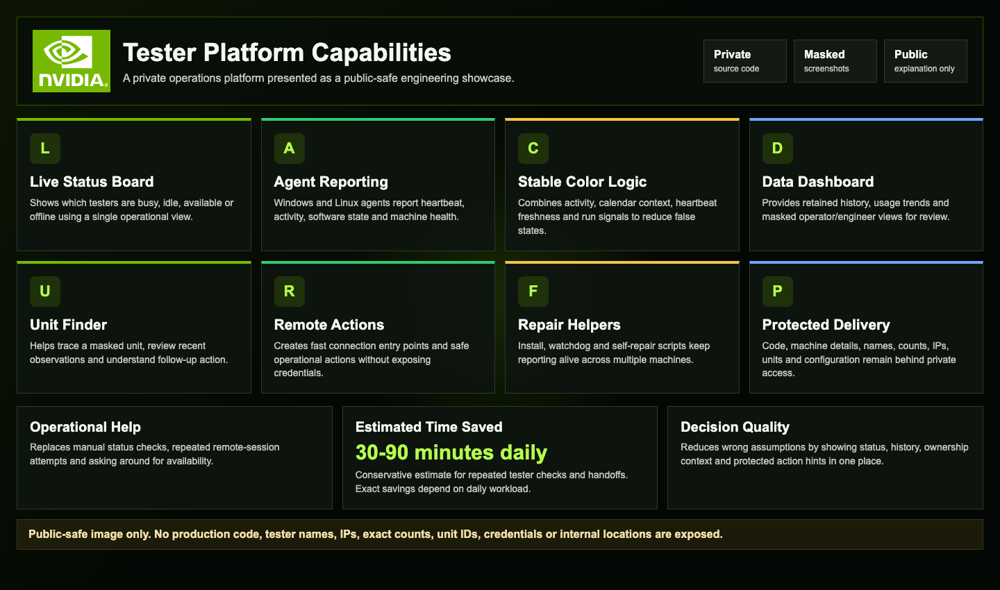

# Tester Monitor Dashboard

Public showcase for a private internal operations platform.

The real source code, machine configuration and production data are private. This repository contains only sanitized screenshots and a professional project explanation.

## Dashboard Overview

## Data Dashboard

## Unit Finder

## Capabilities And Impact

## What This Project Solves

The platform helps operators understand tester availability, tester health and unit movement without manually opening many remote sessions, calling people for status or searching through disconnected files.

It provides a clear operational layer for:

- Live tester status across busy, idle, available and offline states.
- Stable traffic-light rules that reduce false busy/free signals.
- Windows and Linux agent reporting for heartbeat, activity and machine health.
- Calendar-aware status context and booking awareness.
- Data views for retained history, relative usage trends and operational summaries.
- Unit Finder flow for tracing masked units and recent observations.
- Remote action entry points for internal operators.
- Repair, install and watchdog helpers to keep reporting alive.
- Public-safe documentation that explains the product without exposing internal identifiers.

## Work Impact

Estimated impact: **30-90 minutes saved per active workday** for repeated tester checks, handoffs and status verification.

This is a conservative portfolio estimate, not a measured production KPI. The saving comes from replacing manual status checks, repeated remote connection attempts, searching for the right machine/unit context and asking around for availability.

## My Work

I designed and implemented the dashboard experience, status logic, data reporting view, Unit Finder flow, agent reporting pipeline, protected code-download flow, remote install/repair helpers, operational documentation and public-safe portfolio presentation.

## Privacy And Access

This repository intentionally contains only:

- `README.md`
- sanitized showcase images

It does not include production code, tester names, employee names, IP addresses, exact tester counts, unit IDs, internal locations, credentials, customer data or lab configuration.

Source code: private.
